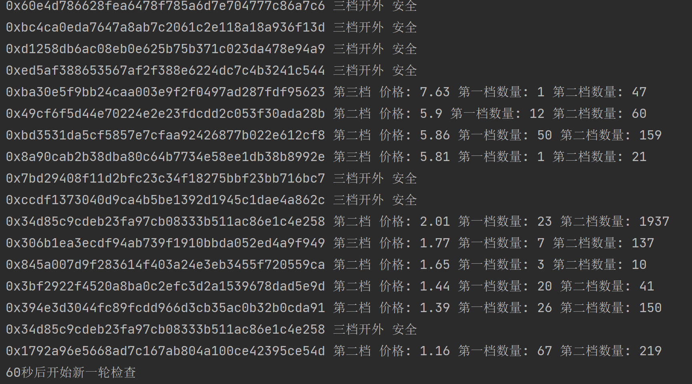
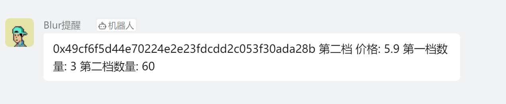

# blur_bid_alert
Blur bid提醒/自动撤单 使用selenium实现

> Blur里面割韭菜的太多，目前我自己刷分亏麻，这个项目不准备维护了，最新版本已经全部开源  
## 使用教程  

### Release版本  
下载压缩包 并按教程配置  

### 源码  
python3.10  
下载浏览器对应版本的chromedriver  
安装依赖`pip install -r requirements.txt`  
创建钉钉机器人/tg机器人  
按照注释中的说明填写对应参数  

## FAQ 持续更新  

* 1.检查chrome版本与下载  
检查自己浏览器版本: chrome://settings/help  
下载地址: https://chromedriver.chromium.org/downloads  

* 2.钉钉机器人创建路径  
电脑版钉钉，创建钉钉群，在钉钉群内 设置-智能群助手-添加机器人-选自定义机器人 添加时的安全设置选择加签  

* 3.多开浏览器  
在Chrome地址栏输入chrome://version/，查看自己的“个人资料路径”  
注意:  
1）路径到User  Data ,不要后面的Default    
2）关闭所有的Chrome进程(必须关闭在运行的浏览器)   
完整复制这个路径到一个新的路径 比如D:\ChromeSelenium  
最后将这个路径填入config.ini的path中  
以上过程比较方便，也可以自己创一个新的空浏览器再添加matamask导入助记词 

* 4.telegram机器人创建  
[BotFather](https://t.me/BotFather)-`/newBot`  
[MCT-Bot](https://t.me/MCT_CLUB_BOT)-`/getchatid` 获取用户id  
机器人创建好后先发一个`/start`激活  

* 5.为什么执行成功可以看到积分但是bid列表为空?  
config.ini 文件中address的地址应为全小写地址  

## 效果  
  

>详细教程后面更新  
>临时写的 有bug正常  
>有问题欢迎issue反馈  
